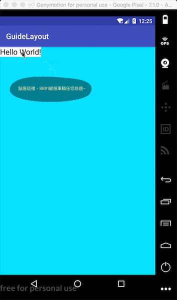

# 新手引导库

## 思路
灵感来源于PS的图层概念。

1. 每个新手引导画面为一个图层
2. 容器显示图层以及背景色
3. 通过设置锚点确定图层的位置(相当于PS中的可整体拖动图层)

## 效果演示

## API

### XML属性

| Name   | Type   | Default| Description|
| ------ | ------ | ------ | ---------- |
| closest | boolean | false | 图层最靠近锚点控件|
| to_anchor | [left_to_left\|left_to_right\|right_to_left\|right_to_right\|center_horizontal]\| [top_to_top\|top_to_bottom\|bottom_to_top\|bottom_to_bottom\|center_vertical] | left_to_left\|top_to_top  | 靠近锚点的位置 |
| to_anchor_x | dimension | 0 | 和锚点x偏移量|
| to_anchor_y | dimension | 0 | 和锚点y偏移量|

### GuideLayout

| Method | description|
| ------ | ---------- |
| addFrame(int layoutId)  | 新增图层|
| addFrame(GuideFrame view) | 新增图层 |
| toFrame(int i) | 显示图层  |
| getFrame(int index) | 获取图层  |
| getFrameIndex() | 获取当前图层索引  |
| dismiss() | 移除新手引导  |

### GuideFrame

| Method | description|
| ------ | ---------- |
| setAnchorView(View view)  | 设置锚点|
| setAnchorRect(Rect rect) | 设置锚点 |
| setDrawDecor(Decor drawDecor) | 设置Decor |
